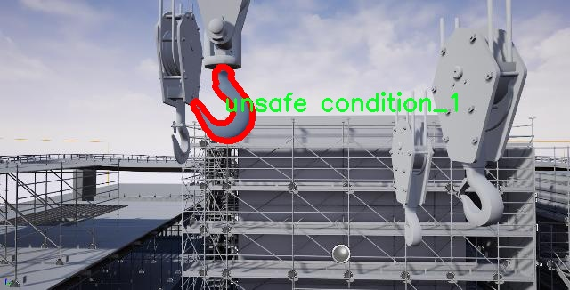

# 挂钩图像分割安全状态与危险状态识别系统源码＆数据集分享
 [yolov8-seg-dyhead＆yolov8-seg-RevCol等50+全套改进创新点发刊_一键训练教程_Web前端展示]

### 1.研究背景与意义

项目参考[ILSVRC ImageNet Large Scale Visual Recognition Challenge](https://gitee.com/YOLOv8_YOLOv11_Segmentation_Studio/projects)

项目来源[AAAI Global Al lnnovation Contest](https://kdocs.cn/l/cszuIiCKVNis)

研究背景与意义

随着工业自动化和智能化的迅速发展，安全生产问题日益凸显，尤其是在涉及高风险作业的领域，如建筑、制造和化工等行业。为了有效保障工人的安全和设备的正常运转，及时识别和判断作业环境中的安全状态与危险状态显得尤为重要。传统的安全监测手段往往依赖于人工巡检和经验判断，存在主观性强、效率低下等缺陷。因此，基于计算机视觉技术的自动化安全状态识别系统应运而生，成为提升安全管理水平的重要工具。

近年来，深度学习技术的飞速发展为图像处理和目标检测提供了新的解决方案。其中，YOLO（You Only Look Once）系列模型因其高效的实时检测能力和较高的准确率而受到广泛关注。YOLOv8作为该系列的最新版本，进一步优化了检测精度和速度，适用于复杂环境下的目标识别任务。然而，现有的YOLOv8模型在处理图像分割任务时仍存在一定的局限性，尤其是在细粒度的安全状态与危险状态识别方面。因此，基于改进YOLOv8的挂钩图像分割安全状态与危险状态识别系统的研究具有重要的理论和实践意义。

本研究所使用的数据集包含1100幅图像，涵盖了三类状态：安全状态、危险状态_1和危险状态_2。这一数据集的构建不仅为模型的训练和验证提供了丰富的样本，也为后续的模型评估和应用奠定了基础。通过对不同状态的图像进行标注和分类，我们能够更深入地理解各类状态的特征，从而为模型的改进提供数据支持。尤其是在危险状态的识别上，能够帮助系统准确区分不同类型的危险，从而为安全管理提供更为精准的决策依据。

在实际应用中，基于改进YOLOv8的挂钩图像分割系统能够实现对工作环境的实时监控和状态评估。当系统检测到危险状态时，可以及时发出警报，提醒相关人员采取必要的安全措施，从而有效降低事故发生的风险。此外，该系统还可以与其他安全管理系统进行联动，形成综合的安全监控网络，提升整体安全管理水平。

综上所述，基于改进YOLOv8的挂钩图像分割安全状态与危险状态识别系统的研究，不仅为安全生产提供了新的技术手段，也为相关领域的学术研究提供了新的视角。通过对安全状态的自动识别与分类，我们可以推动智能安全监测技术的发展，为实现更高水平的安全管理目标奠定坚实的基础。

### 2.图片演示


##### 注意：由于此博客编辑较早，上面“2.图片演示”和“3.视频演示”展示的系统图片或者视频可能为老版本，新版本在老版本的基础上升级如下：（实际效果以升级的新版本为准）

  （1）适配了YOLOV8的“目标检测”模型和“实例分割”模型，通过加载相应的权重（.pt）文件即可自适应加载模型。

  （2）支持“图片识别”、“视频识别”、“摄像头实时识别”三种识别模式。

  （3）支持“图片识别”、“视频识别”、“摄像头实时识别”三种识别结果保存导出，解决手动导出（容易卡顿出现爆内存）存在的问题，识别完自动保存结果并导出到tempDir中。

  （4）支持Web前端系统中的标题、背景图等自定义修改，后面提供修改教程。

  另外本项目提供训练的数据集和训练教程,暂不提供权重文件（best.pt）,需要您按照教程进行训练后实现图片演示和Web前端界面演示的效果。

### 3.视频演示

[3.1 视频演示](https://www.bilibili.com/video/BV1R1DcYfEr1/)

### 4.数据集信息展示

##### 4.1 本项目数据集详细数据（类别数＆类别名）

nc: 3
names: ['safety condition', 'unsafe condition_1', 'unsafe condition_2']


##### 4.2 本项目数据集信息介绍

数据集信息展示

在本研究中，我们使用了名为“test1”的数据集，以支持改进YOLOv8-seg的挂钩图像分割安全状态与危险状态识别系统的训练与验证。该数据集专门设计用于处理与安全相关的图像分类任务，旨在提高系统对不同安全状态的识别能力，从而为实际应用提供更为精准的安全监测解决方案。

“test1”数据集包含三种主要类别，分别为“安全状态”、“危险状态_1”和“危险状态_2”。这些类别的选择反映了在实际应用中可能遇到的多样化安全场景，能够有效地模拟和识别不同的安全与危险状态。在训练过程中，数据集中的每一类都被精心标注，以确保模型能够准确学习到每种状态的特征和表现。

首先，“安全状态”类别代表了设备或环境处于正常运行状态的情形。在这一类别中，图像展示了设备的正常操作流程，工作人员遵循安全规程，且没有任何潜在的危险因素。这些图像的特征包括清晰的工作环境、合规的设备配置以及工作人员的安全防护措施。通过提供大量的“安全状态”图像，模型能够学习到正常情况下的视觉特征，从而在后续的识别任务中，能够更好地区分安全与危险状态。

其次，“危险状态_1”类别则用于标识那些存在明显安全隐患的情形。这些图像可能展示了设备故障、工作人员未佩戴安全装备、或者存在其他潜在的危险因素。这一类别的图像通常包含了高风险的工作环境，可能导致事故的情景。通过对这一类别的深入学习，模型能够识别出这些危险信号，从而在实际应用中及时发出警报，防止事故的发生。

最后，“危险状态_2”类别则涵盖了更加复杂和隐蔽的危险情形。这些图像可能展示了环境中的微小变化或潜在的风险因素，例如设备的轻微损坏、环境中的杂物等，这些都可能在不经意间导致安全事故。通过对这一类别的训练，模型将能够提高对隐蔽危险的敏感性，从而增强整体的安全监测能力。

数据集“test1”的构建不仅考虑了类别的多样性，还注重了图像的质量和标注的准确性。每一张图像都经过严格的筛选和标注，以确保其在训练过程中的有效性。此外，数据集的规模也经过精心设计，以便于模型在训练时能够获得足够的样本，从而提高其泛化能力和准确性。

综上所述，数据集“test1”在本研究中扮演了至关重要的角色。通过对安全状态与危险状态的深入分析与分类，该数据集为改进YOLOv8-seg的挂钩图像分割系统提供了坚实的基础，确保模型能够在实际应用中实现高效的安全监测与识别。随着训练的深入，期待该系统能够在未来的安全管理中发挥重要作用，为各类工作环境的安全保障提供有力支持。





### 5.全套项目环境部署视频教程（零基础手把手教学）

[5.1 环境部署教程链接（零基础手把手教学）](https://www.bilibili.com/video/BV1jG4Ve4E9t/?vd_source=bc9aec86d164b67a7004b996143742dc)


[5.2 安装Python虚拟环境创建和依赖库安装视频教程链接（零基础手把手教学）](https://www.bilibili.com/video/BV1nA4VeYEze/?vd_source=bc9aec86d164b67a7004b996143742dc)

### 6.手把手YOLOV8-seg训练视频教程（零基础小白有手就能学会）

[6.1 手把手YOLOV8-seg训练视频教程（零基础小白有手就能学会）](https://www.bilibili.com/video/BV1cA4VeYETe/?vd_source=bc9aec86d164b67a7004b996143742dc)


按照上面的训练视频教程链接加载项目提供的数据集，运行train.py即可开始训练



     Epoch   gpu_mem       box       obj       cls    labels  img_size
     1/200     0G   0.01576   0.01955  0.007536        22      1280: 100%|██████████| 849/849 [14:42<00:00,  1.04s/it]
               Class     Images     Labels          P          R     mAP@.5 mAP@.5:.95: 100%|██████████| 213/213 [01:14<00:00,  2.87it/s]
                 all       3395      17314      0.994      0.957      0.0957      0.0843

     Epoch   gpu_mem       box       obj       cls    labels  img_size
     2/200     0G   0.01578   0.01923  0.007006        22      1280: 100%|██████████| 849/849 [14:44<00:00,  1.04s/it]
               Class     Images     Labels          P          R     mAP@.5 mAP@.5:.95: 100%|██████████| 213/213 [01:12<00:00,  2.95it/s]
                 all       3395      17314      0.996      0.956      0.0957      0.0845

     Epoch   gpu_mem       box       obj       cls    labels  img_size
     3/200     0G   0.01561    0.0191  0.006895        27      1280: 100%|██████████| 849/849 [10:56<00:00,  1.29it/s]
               Class     Images     Labels          P          R     mAP@.5 mAP@.5:.95: 100%|███████   | 187/213 [00:52<00:00,  4.04it/s]
                 all       3395      17314      0.996      0.957      0.0957      0.0845


### 7.50+种全套YOLOV8-seg创新点代码加载调参视频教程（一键加载写好的改进模型的配置文件）

[7.1 50+种全套YOLOV8-seg创新点代码加载调参视频教程（一键加载写好的改进模型的配置文件）](https://www.bilibili.com/video/BV1Hw4VePEXv/?vd_source=bc9aec86d164b67a7004b996143742dc)

### 8.YOLOV8-seg图像分割算法原理

原始YOLOv8-seg算法原理

YOLOv8-seg算法是目标检测领域的一项重要进展，继承了YOLO系列算法的优良传统，同时在多个方面进行了创新和优化。该算法的提出者Glenn-Jocher在YOLOv3和YOLOv5的基础上，结合了深度学习的最新研究成果，旨在提高目标检测的精度和速度，尤其是在复杂场景下的表现。YOLOv8-seg不仅仅关注目标的定位和分类，还引入了分割功能，使得其在处理实例分割任务时具有更强的能力。

首先，YOLOv8-seg在数据预处理阶段延续了YOLOv5的策略，采用了多种数据增强技术。这些技术包括马赛克增强、混合增强、空间扰动和颜色扰动等，旨在提高模型的鲁棒性和泛化能力。马赛克增强通过将多张图像拼接在一起，增加了训练样本的多样性，而混合增强则通过将不同图像的特征进行融合，进一步丰富了数据集的特征空间。这些预处理方法为后续的特征提取和目标检测奠定了坚实的基础。

在骨干网络结构方面，YOLOv8-seg延续了YOLOv5的设计理念，但进行了重要的改进。原有的C3模块被新的C2f模块所替代，C2f模块引入了更多的分支，增强了梯度回传过程中的信息流动。这种设计不仅提高了特征提取的效率，还增强了模型对复杂特征的学习能力。C2f模块的多分支结构使得网络能够更好地捕捉到不同尺度和不同层次的特征信息，从而提升了目标检测的精度。

YOLOv8-seg还采用了特征金字塔网络（FPN）和路径聚合网络（PAN）的结合结构。这种结构的设计使得多尺度信息能够在不同层次之间进行充分的融合，增强了模型对小目标和大目标的检测能力。FPN通过自上而下的特征融合，确保了高层语义信息能够传递到低层特征图中，而PAN则通过自下而上的特征聚合，增强了低层特征的语义信息。这种特征融合策略使得YOLOv8-seg在处理复杂场景时，能够更好地理解和定位目标。

在检测头的设计上，YOLOv8-seg采用了解耦头的结构，这一设计灵感来源于YOLOX的创新。解耦头将分类和定位任务分开处理，分别通过两条并行的分支进行特征提取和预测。这种结构的优势在于，它能够更专注于各自的任务，从而提高模型的整体性能。分类分支专注于提取类别特征，而定位分支则专注于目标的位置信息，这种分离使得模型在复杂场景下的表现更加优异。

在标签分配策略方面，YOLOv8-seg引入了动态标签分配策略，解决了正负样本匹配的问题。与YOLOX的SimOTA策略不同，YOLOv8-seg采用了TOOD策略，这种策略能够根据目标的特征动态调整标签的分配，确保每个样本都能得到合理的处理。YOLOv8-seg的损失函数设计也相对复杂，主要包括类别损失和位置损失。类别损失采用了变焦损失（VFL），而位置损失则结合了CIoULoss和DFLLoss。这种设计使得模型在训练过程中能够更加关注高质量的正样本，同时降低负样本对损失的影响，从而提高模型的学习效率。

总的来说，YOLOv8-seg算法在目标检测和实例分割任务中展现出了强大的能力。通过对数据预处理、骨干网络、特征融合、检测头和标签分配策略等多个方面的优化，YOLOv8-seg不仅提高了检测精度，还在速度上实现了显著的提升。这使得YOLOv8-seg在实际应用中具有更广泛的适用性，能够应对各种复杂的视觉任务。随着深度学习技术的不断发展，YOLOv8-seg无疑将成为目标检测领域的重要工具，为各类应用提供更为精准和高效的解决方案。


### 9.系统功能展示（检测对象为举例，实际内容以本项目数据集为准）

图9.1.系统支持检测结果表格显示

  图9.2.系统支持置信度和IOU阈值手动调节

  图9.3.系统支持自定义加载权重文件best.pt(需要你通过步骤5中训练获得)

  图9.4.系统支持摄像头实时识别

  图9.5.系统支持图片识别

  图9.6.系统支持视频识别

  图9.7.系统支持识别结果文件自动保存

  图9.8.系统支持Excel导出检测结果数据


### 10.50+种全套YOLOV8-seg创新点原理讲解（非科班也可以轻松写刊发刊，V11版本正在科研待更新）

#### 10.1 由于篇幅限制，每个创新点的具体原理讲解就不一一展开，具体见下列网址中的创新点对应子项目的技术原理博客网址【Blog】：


[10.1 50+种全套YOLOV8-seg创新点原理讲解链接](https://gitee.com/qunmasj/good)

#### 10.2 部分改进模块原理讲解(完整的改进原理见上图和技术博客链接)【如果此小节的图加载失败可以通过CSDN或者Github搜索该博客的标题访问原始博客，原始博客图片显示正常】
### YOLOv8模型原理

YOLOv8是YOLO系列最新的模型,具有非常优秀的检测精度和速度。根据网络的深度与特征图的宽度大小, YOLOv8算法分为:YOLOv8-n、YOLOv8一s 、YOLOv8-m 、 YOLOv8-l、和 YOLOv8-x 5个版本。按照网络结构图,YOLOv8可分为: Inpul 、 Backbone , Neck和Head 4部分。


Backbone采用了CSPDarknet 架构，由CBS (标准卷积层)、C2f模块和 SPPF(金字塔池化）组成。通过5次标准卷积层和C2f模块逐步提取图像特征，并在网络末尾添加SPPF模块，将任意大小的输入图像转换成固定大小的特征向量。分别取P3、P4、P5层的特征提取结果，向Head输出80×80、40 × 40、20×20三个尺度的特征层。
C2f模块借鉴了残差网络(ResNet)以及ELAN的思想，其结构分为两个分支，主干部分利用Bottleneckm2%模块逐步加深网络，分支部分保留输入层通道并与主干部分特征进行融合，如图所示。通过标准卷积层提取新的特征层，相比于YOLOv5使用的C3模块，C2f模块可以在卷积层和全连接层之间建立一个平滑的转换，从而实现了参数的共享，提高了模型的效率和泛化能力。
Head采用了PAN-FPN 结构,将 Backbone输入的3个特征层进行多尺度融合，进行自顶向下(FAN)和自底向上 (PAN)的特征传递，对金字塔进行增强，使不同尺寸的特征图都包含强目标语义信息和强目标特征信息，保证了对不同尺寸样本的准确预测。
Detect借鉴了Decoupled-Head 思想，用一个解耦检测头将输入的不同尺寸特征层分成2个分支进行检测。第1个分支在进行3次卷积后使进行回归任务，输出预测框。第2个分支在进行3次卷积后进行分类任务，输出类别的概率。采用Varifocal_Loss2”作为损失函数，其式为:


### Context_Grided_Network(CGNet)简介
参考该博客提出的一种轻量化语义分割模型Context Grided Network(CGNet)，以满足设备的运行需要。

CGNet主要由CG块构建而成，CG块可以学习局部特征和周围环境上下文的联合特征，最后通过引入全局上下文特征进一步改善联合特征的学习。


 
下图给出了在Cityscapes数据集上对现有的一些语义分割模型的测试效果，横轴表示参数量，纵轴表示准确率(mIoU)。可以看出，在参数量较少的情况下，CGNet可以达到一个比较好的准确率。虽与高精度模型相去甚远，但在一些对精度要求不高、对实时性要求比较苛刻的情况下，很有价值。


高精度模型，如DeepLab、DFN、DenseASPP等，动不动就是几十M的参数，很难应用在移动设备上。而上图中红色的模型，相对内存占用较小，但它们的分割精度却不是很高。作者认为主要原因是，这些小网络大多遵循着分类网络的设计思路，并没有考虑语义分割任务更深层次的特点。

空间依赖性和上下文信息对提高分割精度有很大的作用。作者从该角度出发，提出了CG block，并进一步搭建了轻量级语义分割网络CGNet。CG块具有以下特点： 

学习局部特征和上下文特征的联合特征；
通过全局上下文特征改进上述联合特征；
可以贯穿应用在整个网络中，从low level（空间级别）到high level（语义级别）。不像PSPNet、DFN、DenseASPP等，只在编码阶段以后捕捉上下文特征。；
只有3个下采样，相比一般5个下采样的网络，能够更好地保留边缘信息。
CGNet遵循“深而薄”的原则设计，整个网络又51层构成。其中，为了降低计算，大量使用了channel-wise conv.

小型语义分割模型：

需要平衡准确率和系统开销
进化路线：ENet -> ICNet -> ESPNet
这些模型基本都基于分类网络设计，在分割准确率上效果并不是很好
上下文信息模型：

大多数现有模型只考虑解码阶段的上下文信息并且没有利用周围的上下文信息
注意力机制：

CG block使用全局上下文信息计算权重向量，并使用其细化局部特征和周围上下文特征的联合特征

#### Context Guided Block
CG block由4部分组成：


此外，CG block还采用了残差学习。文中提出了局部残差学习（LRL）和全局残差学习（GRL）两种方式。 LRL添加了从输入到联合特征提取器的连接，GRL添加了从输入到全局特征提取器的连接。从直观上来说，GRL比LRL更能促进网络中的信息传递（更像ResNet~~），后面实验部分也进行了测试，的确GRL更能提升分割精度。


CGNet的通用网络结构如下图所示，分为3个stage，第一个stage使用3个卷积层抽取特征，第二和第三个stage堆叠一定数量的CG block，具体个数可以根据情况调整。最后，通过1x1 conv得到分割结果。


下图是用于Cityscapes数据集的CGNet网络细节说明：输入尺寸为3*680*680；stage1连续使用了3个Conv-BN-PReLU组合，首个组合使用了stride=2的卷积，所以得到了1/2分辨率的feature map；stage2和stage3分别使用了多个CG block，且其中使用了不同大小的膨胀卷积核，最终分别得到了1/4和1/8的feature map。

需注意：

stage2&3的输入特征分别由其上一个stage的首个和最后一个block组合给出（参考上图的绿色箭头）；

输入注入机制，图中未体现，实际使用中，作者还将输入图像下采样1/4或1/8，分别给到stage2和stage3的输入中 ，以进一步加强特征传递。

channel-wise conv。为了缩减参数数量，在局部特征提取器和周围上下文特征提取器中使用了channel-wise卷积，可以消除跨通道的计算成本，同时节省内存占用。但是，没有像MobileNet等模型一样，在depth-wise卷积后面接point-wise卷积（1*1 conv），作者解释是，因为CG block需要保持局部特征和周围上下文特征的独立性，而1*1 conv会破坏这种独立性，所以效果欠佳，实验部分也进行了验证。

个人感觉此处应该指的是depth-wise卷积？

官方Git中对该部分的实现如下：


### 11.项目核心源码讲解（再也不用担心看不懂代码逻辑）

#### 11.1 model.py

以下是对代码的核心部分进行提炼和详细注释的结果：

```python
# -*- coding: utf-8 -*-
import cv2  # 导入OpenCV库，用于处理图像和视频
import torch  # 导入PyTorch库，用于深度学习模型的处理
from QtFusion.models import Detector  # 从QtFusion库中导入Detector抽象基类
from chinese_name_list import Chinese_name  # 从datasets库中导入Chinese_name字典，用于获取类别的中文名称
from ultralytics import YOLO  # 从ultralytics库中导入YOLO类，用于加载YOLO模型
from ultralytics.utils.torch_utils import select_device  # 从ultralytics库中导入select_device函数，用于选择设备
import os  # 导入os库，用于处理文件和目录

# 选择计算设备，优先使用GPU
device = "cuda:0" if torch.cuda.is_available() else "cpu"

# 初始化参数字典
ini_params = {
    'device': device,  # 设备类型
    'conf': 0.3,  # 物体置信度阈值
    'iou': 0.05,  # 用于非极大值抑制的IOU阈值
    'classes': None,  # 类别过滤器
    'verbose': False  # 是否详细输出
}

class Web_Detector(Detector):  # 定义YOLOv8Detector类，继承自Detector类
    def __init__(self, params=None):  # 构造函数
        super().__init__(params)  # 调用父类构造函数
        self.model = None  # 初始化模型为None
        self.img = None  # 初始化图像为None
        self.names = list(Chinese_name.values())  # 获取所有类别的中文名称
        self.params = params if params else ini_params  # 使用提供的参数或默认参数

    def load_model(self, model_path):  # 加载模型的方法
        self.device = select_device(self.params['device'])  # 选择计算设备
        task = 'segment' if os.path.basename(model_path)[:3] == 'seg' else 'detect'  # 根据模型文件名判断任务类型
        self.model = YOLO(model_path, task=task)  # 加载YOLO模型
        names_dict = self.model.names  # 获取类别名称字典
        # 将类别名称转换为中文
        self.names = [Chinese_name[v] if v in Chinese_name else v for v in names_dict.values()]  
        # 预热模型
        self.model(torch.zeros(1, 3, *[self.imgsz] * 2).to(self.device).type_as(next(self.model.model.parameters())))

    def preprocess(self, img):  # 图像预处理方法
        self.img = img  # 保存原始图像
        return img  # 返回处理后的图像

    def predict(self, img):  # 预测方法
        results = self.model(img, **ini_params)  # 使用模型进行预测
        return results  # 返回预测结果

    def postprocess(self, pred):  # 后处理方法
        results = []  # 初始化结果列表
        for res in pred[0].boxes:  # 遍历预测结果中的每个边界框
            for box in res:  # 遍历每个边界框
                class_id = int(box.cls.cpu())  # 获取类别ID
                bbox = box.xyxy.cpu().squeeze().tolist()  # 获取边界框坐标并转换为列表
                bbox = [int(coord) for coord in bbox]  # 转换边界框坐标为整数

                # 构建结果字典
                result = {
                    "class_name": self.names[class_id],  # 类别名称
                    "bbox": bbox,  # 边界框
                    "score": box.conf.cpu().squeeze().item(),  # 置信度
                    "class_id": class_id,  # 类别ID
                    "mask": pred[0].masks[aim_id].xy if pred[0].masks is not None else None  # 掩膜
                }
                results.append(result)  # 将结果添加到列表

        return results  # 返回结果列表

    def set_param(self, params):  # 设置参数的方法
        self.params.update(params)  # 更新参数字典
```

### 代码核心部分说明：
1. **导入库**：引入必要的库，包括OpenCV、PyTorch、YOLO模型和中文名称字典。
2. **设备选择**：根据系统是否支持CUDA选择计算设备。
3. **参数初始化**：设置YOLO模型的基本参数，如置信度阈值和IOU阈值。
4. **Web_Detector类**：定义了一个检测器类，负责加载模型、预处理图像、进行预测和后处理结果。
5. **模型加载**：根据模型路径加载YOLO模型，并转换类别名称为中文。
6. **图像处理**：实现了图像的预处理、预测和后处理功能，返回检测到的对象信息。

以上代码的核心部分提供了一个YOLOv8目标检测的基本框架，适用于实时图像或视频流的物体检测任务。

这个文件 `model.py` 主要用于实现一个基于YOLO（You Only Look Once）模型的目标检测器，使用了PyTorch和OpenCV库。文件中定义了一个名为 `Web_Detector` 的类，继承自 `Detector` 抽象基类，主要负责加载模型、处理图像、进行预测以及后处理结果。

首先，文件导入了一些必要的库，包括OpenCV用于图像处理，PyTorch用于深度学习模型的加载和推理，QtFusion库中的 `Detector` 和 `HeatmapGenerator`，以及 `Chinese_name` 字典用于获取类别的中文名称。此外，还从 `ultralytics` 库中导入了YOLO类和设备选择函数。

接下来，代码设置了一些初始化参数，包括设备类型（根据是否有可用的GPU选择），物体置信度阈值、IOU阈值和类别过滤器等。

`count_classes` 函数用于统计检测结果中每个类别的数量。它接收检测信息和类别名称列表，遍历检测信息并更新每个类别的计数，最后返回一个按类别顺序排列的计数列表。

`Web_Detector` 类的构造函数初始化了一些属性，包括模型、图像和类别名称。`load_model` 方法用于加载YOLO模型，并根据模型路径判断任务类型（这里统一为分割任务），同时将类别名称转换为中文。为了提高推理效率，模型还会进行一次预热。

`preprocess` 方法用于对输入图像进行预处理，当前实现中只是简单地保存原始图像并返回。

`predict` 方法接受一张图像并调用YOLO模型进行预测，返回预测结果。

`postprocess` 方法对预测结果进行后处理，提取每个检测框的信息，包括类别名称、边界框坐标、置信度和类别ID，并将这些信息存储在结果列表中返回。

最后，`set_param` 方法用于更新检测器的参数。

总体而言，这个文件实现了一个完整的目标检测流程，包括模型加载、图像预处理、预测和结果后处理，适用于基于YOLO的目标检测任务。

#### 11.2 ultralytics\nn\extra_modules\ops_dcnv3\modules\dcnv3.py

以下是代码中最核心的部分，并附上详细的中文注释：

```python
import torch
from torch import nn
import torch.nn.functional as F

class DCNv3(nn.Module):
    def __init__(self,
                 channels=64,
                 kernel_size=3,
                 stride=1,
                 pad=1,
                 dilation=1,
                 group=4,
                 offset_scale=1.0,
                 center_feature_scale=False,
                 remove_center=False):
        """
        DCNv3模块的初始化
        :param channels: 输入和输出的通道数
        :param kernel_size: 卷积核的大小
        :param stride: 卷积的步幅
        :param pad: 卷积的填充
        :param dilation: 卷积的扩张
        :param group: 分组卷积的组数
        :param offset_scale: 偏移量的缩放因子
        :param center_feature_scale: 是否使用中心特征缩放
        :param remove_center: 是否移除中心点
        """
        super().__init__()
        if channels % group != 0:
            raise ValueError(f'channels must be divisible by group, but got {channels} and {group}')
        
        self.channels = channels
        self.kernel_size = kernel_size
        self.stride = stride
        self.dilation = dilation
        self.pad = pad
        self.group = group
        self.group_channels = channels // group
        self.offset_scale = offset_scale
        self.center_feature_scale = center_feature_scale
        self.remove_center = int(remove_center)

        # 初始化卷积层、偏移量和掩码的线性层
        self.dw_conv = nn.Conv2d(channels, channels, kernel_size, stride=1, padding=pad, groups=channels)
        self.offset = nn.Linear(channels, group * (kernel_size * kernel_size - remove_center) * 2)
        self.mask = nn.Linear(channels, group * (kernel_size * kernel_size - remove_center))
        self.input_proj = nn.Linear(channels, channels)
        self.output_proj = nn.Linear(channels, channels)
        self._reset_parameters()

        if center_feature_scale:
            self.center_feature_scale_proj_weight = nn.Parameter(torch.zeros((group, channels), dtype=torch.float))
            self.center_feature_scale_proj_bias = nn.Parameter(torch.tensor(0.0, dtype=torch.float).repeat(group))

    def _reset_parameters(self):
        """重置模型参数"""
        nn.init.constant_(self.offset.weight.data, 0.)
        nn.init.constant_(self.offset.bias.data, 0.)
        nn.init.constant_(self.mask.weight.data, 0.)
        nn.init.constant_(self.mask.bias.data, 0.)
        nn.init.xavier_uniform_(self.input_proj.weight.data)
        nn.init.constant_(self.input_proj.bias.data, 0.)
        nn.init.xavier_uniform_(self.output_proj.weight.data)
        nn.init.constant_(self.output_proj.bias.data, 0.)

    def forward(self, input):
        """
        前向传播
        :param input: 输入张量，形状为 (N, H, W, C)
        :return: 输出张量，形状为 (N, H, W, C)
        """
        N, H, W, _ = input.shape

        # 输入投影
        x = self.input_proj(input)
        x_proj = x  # 保存输入投影的结果

        # 深度卷积
        x1 = input.permute(0, 3, 1, 2)  # 将输入的通道维度移到前面
        x1 = self.dw_conv(x1).permute(0, 2, 3, 1)  # 深度卷积并恢复维度

        # 计算偏移量和掩码
        offset = self.offset(x1)
        mask = self.mask(x1).reshape(N, H, W, self.group, -1)
        mask = F.softmax(mask, -1).reshape(N, H, W, -1)  # 归一化掩码

        # 应用DCN操作
        x = DCNv3Function.apply(
            x, offset, mask,
            self.kernel_size, self.kernel_size,
            self.stride, self.stride,
            self.pad, self.pad,
            self.dilation, self.dilation,
            self.group, self.group_channels,
            self.offset_scale,
            256,
            self.remove_center)

        # 如果启用中心特征缩放
        if self.center_feature_scale:
            center_feature_scale = self.center_feature_scale_proj_weight @ x1 + self.center_feature_scale_proj_bias
            center_feature_scale = center_feature_scale[..., None].repeat(1, 1, 1, 1, self.channels // self.group).flatten(-2)
            x = x * (1 - center_feature_scale) + x_proj * center_feature_scale  # 融合特征

        # 输出投影
        x = self.output_proj(x)

        return x  # 返回输出
```

### 代码核心部分说明：
1. **DCNv3类**：实现了深度可分离卷积（DCN）的核心模块，支持多种参数配置。
2. **初始化方法**：设置卷积层、线性层等，并检查通道数是否能被组数整除。
3. **_reset_parameters方法**：初始化模型参数，确保模型的训练稳定性。
4. **forward方法**：实现前向传播逻辑，包括输入投影、深度卷积、偏移量和掩码的计算，以及最终的输出投影。

### 重要概念：
- **深度可分离卷积**：将卷积操作分为深度卷积和逐点卷积，提高计算效率。
- **偏移量和掩码**：用于动态卷积操作，使得卷积核能够根据输入特征进行自适应调整。
- **中心特征缩放**：根据中心特征的权重调整输出特征，以增强模型的表达能力。

这个程序文件是一个实现深度学习模块的Python代码，主要涉及到DCNv3（Deformable Convolutional Networks v3）模块的构建和使用。该模块是用于计算机视觉任务中的一种卷积操作，能够处理形状和大小不规则的输入数据。代码中使用了PyTorch库，以下是对代码的详细讲解。

首先，文件中导入了一些必要的库和模块，包括PyTorch的神经网络模块（`torch.nn`）和一些函数（如`F`用于激活函数）。接着，定义了一些辅助类和函数，比如`to_channels_first`和`to_channels_last`，它们用于在通道优先和通道最后的格式之间进行转换。

`build_norm_layer`函数用于构建归一化层，可以选择使用批归一化（Batch Normalization）或层归一化（Layer Normalization），并根据输入和输出格式进行相应的通道转换。`build_act_layer`函数则用于构建激活函数层，支持ReLU、SiLU和GELU等激活函数。

接下来，定义了一个检查数字是否为2的幂的辅助函数`_is_power_of_2`，用于确保输入的通道数在某些情况下是有效的。

`CenterFeatureScaleModule`类是一个简单的前向传播模块，用于计算中心特征缩放。接下来的`DCNv3_pytorch`类实现了DCNv3模块的主要功能。该类的构造函数接受多个参数，包括通道数、卷积核大小、步幅、填充、扩张、分组数等，并根据这些参数初始化相应的层。

在`DCNv3_pytorch`类中，定义了深度卷积（dw_conv）、偏移量（offset）、掩码（mask）和输入输出投影（input_proj和output_proj）等层。`_reset_parameters`方法用于初始化这些层的参数。`forward`方法实现了模块的前向传播逻辑，输入为形状为(N, H, W, C)的张量，经过一系列的卷积、偏移和掩码操作后，输出一个相同形状的张量。

`DCNv3`类是对`DCNv3_pytorch`类的封装，提供了相似的功能，但使用了不同的卷积实现（`Conv`类）。`DCNv3_DyHead`类则是DCNv3模块的一个变体，主要用于动态头部的实现，具有类似的结构和功能。

整体来看，这个文件实现了DCNv3模块的构建和前向传播，支持多种参数配置，适用于深度学习中的图像处理任务。通过灵活的层构建和参数设置，用户可以根据具体需求定制DCNv3模块的行为。

#### 11.3 ultralytics\models\yolo\detect\__init__.py

```python
# 导入必要的模块和类
# Ultralytics YOLO 🚀, AGPL-3.0 license

# 从当前包中导入检测预测器、训练器和验证器
from .predict import DetectionPredictor  # 导入用于目标检测的预测类
from .train import DetectionTrainer      # 导入用于训练模型的训练类
from .val import DetectionValidator      # 导入用于验证模型性能的验证类

# 定义当前模块的公开接口
# 这意味着在使用 `from module import *` 时，只会导入以下类
__all__ = 'DetectionPredictor', 'DetectionTrainer', 'DetectionValidator'
``` 

### 代码注释说明：
1. **导入模块**：代码首先导入了三个核心类，分别用于目标检测的预测、模型的训练和模型的验证。
2. **`__all__` 变量**：定义了模块的公开接口，确保在使用 `from module import *` 时，只导入指定的类，避免不必要的命名冲突和提高代码的可读性。

这个程序文件是Ultralytics YOLO模型的一部分，主要用于目标检测。文件名为`__init__.py`，它的存在使得包含它的目录被视为一个Python包。文件中首先有一个注释，说明这是Ultralytics YOLO项目的一部分，并提到该项目遵循AGPL-3.0许可证。

接下来，文件通过相对导入的方式引入了三个类：`DetectionPredictor`、`DetectionTrainer`和`DetectionValidator`。这些类分别负责目标检测的不同功能：`DetectionPredictor`用于进行目标检测的预测，`DetectionTrainer`用于训练模型，而`DetectionValidator`则用于验证模型的性能。

最后，`__all__`变量被定义为一个元组，包含了上述三个类的名称。这意味着当使用`from ultralytics.models.yolo.detect import *`这种方式导入时，只会导入`DetectionPredictor`、`DetectionTrainer`和`DetectionValidator`这三个类。这种做法有助于控制模块的公共接口，避免不必要的名称冲突或误用。整体来看，这个文件的结构简洁明了，主要用于组织和管理YOLO模型的相关功能。

#### 11.4 ultralytics\utils\callbacks\wb.py

以下是经过简化和注释的核心代码部分：

```python
# 导入必要的库
from ultralytics.utils import SETTINGS, TESTS_RUNNING
from ultralytics.utils.torch_utils import model_info_for_loggers

# 尝试导入wandb库并进行一些基本的检查
try:
    assert not TESTS_RUNNING  # 确保当前不是在运行测试
    assert SETTINGS['wandb'] is True  # 确保wandb集成已启用
    import wandb as wb
    assert hasattr(wb, '__version__')  # 确保wandb包是有效的

    import numpy as np
    import pandas as pd

    _processed_plots = {}  # 用于存储已处理的图表

except (ImportError, AssertionError):
    wb = None  # 如果导入失败，设置wb为None

def _custom_table(x, y, classes, title='Precision Recall Curve', x_title='Recall', y_title='Precision'):
    """
    创建并记录自定义的精确度-召回率曲线可视化。

    参数:
        x (List): x轴的值，长度为N。
        y (List): y轴的值，长度为N。
        classes (List): 每个点的类别标签，长度为N。
        title (str, optional): 图表标题，默认为'Precision Recall Curve'。
        x_title (str, optional): x轴标签，默认为'Recall'。
        y_title (str, optional): y轴标签，默认为'Precision'。

    返回:
        (wandb.Object): 适合记录的wandb对象，展示自定义的可视化指标。
    """
    # 创建一个DataFrame用于存储数据
    df = pd.DataFrame({'class': classes, 'y': y, 'x': x}).round(3)
    fields = {'x': 'x', 'y': 'y', 'class': 'class'}
    string_fields = {'title': title, 'x-axis-title': x_title, 'y-axis-title': y_title}
    
    # 返回wandb表格对象
    return wb.plot_table('wandb/area-under-curve/v0',
                         wb.Table(dataframe=df),
                         fields=fields,
                         string_fields=string_fields)

def _plot_curve(x, y, names=None, id='precision-recall', title='Precision Recall Curve', x_title='Recall', y_title='Precision', num_x=100, only_mean=False):
    """
    记录指标曲线可视化。

    参数:
        x (np.ndarray): x轴数据点，长度为N。
        y (np.ndarray): y轴数据点，形状为CxN，C为类别数。
        names (list, optional): y轴数据对应的类别名称，长度为C。
        id (str, optional): 记录数据的唯一标识符，默认为'precision-recall'。
        title (str, optional): 可视化图表的标题，默认为'Precision Recall Curve'。
        x_title (str, optional): x轴标签，默认为'Recall'。
        y_title (str, optional): y轴标签，默认为'Precision'。
        num_x (int, optional): 可视化的插值数据点数量，默认为100。
        only_mean (bool, optional): 是否仅绘制均值曲线的标志，默认为True。
    """
    # 创建新的x值
    if names is None:
        names = []
    x_new = np.linspace(x[0], x[-1], num_x).round(5)

    # 创建用于记录的数组
    x_log = x_new.tolist()
    y_log = np.interp(x_new, x, np.mean(y, axis=0)).round(3).tolist()

    if only_mean:
        # 仅记录均值曲线
        table = wb.Table(data=list(zip(x_log, y_log)), columns=[x_title, y_title])
        wb.run.log({title: wb.plot.line(table, x_title, y_title, title=title)})
    else:
        # 记录每个类别的曲线
        classes = ['mean'] * len(x_log)
        for i, yi in enumerate(y):
            x_log.extend(x_new)  # 添加新的x值
            y_log.extend(np.interp(x_new, x, yi))  # 将y插值到新的x
            classes.extend([names[i]] * len(x_new))  # 添加类别名称
        wb.log({id: _custom_table(x_log, y_log, classes, title, x_title, y_title)}, commit=False)

# 训练过程中的回调函数
callbacks = {
    'on_pretrain_routine_start': on_pretrain_routine_start,
    'on_train_epoch_end': on_train_epoch_end,
    'on_fit_epoch_end': on_fit_epoch_end,
    'on_train_end': on_train_end} if wb else {}
```

### 代码说明：
1. **导入部分**：导入了必要的库，包括`wandb`用于可视化和记录训练过程中的指标。
2. **异常处理**：尝试导入`wandb`并进行基本的有效性检查，如果失败则将`wb`设置为`None`。
3. **_custom_table 函数**：创建一个自定义的精确度-召回率曲线，并将其记录到`wandb`中。
4. **_plot_curve 函数**：生成并记录一个指标曲线的可视化，支持均值曲线和每个类别的曲线。
5. **回调函数**：定义了一些回调函数，用于在训练过程中记录和处理指标。

通过这些核心部分，代码实现了对模型训练过程中的指标进行可视化和记录的功能。

这个程序文件 `ultralytics/utils/callbacks/wb.py` 是用于集成 Weights & Biases（wandb）库，以便在训练过程中记录和可视化模型的性能指标。程序首先导入了一些必要的模块，并进行了一些基本的检查，确保在非测试环境下运行，并且wandb集成已启用。

在程序中，定义了几个函数来处理不同的任务。`_custom_table` 函数用于创建并记录一个自定义的精确度-召回曲线的可视化，允许用户自定义图表的标题和轴标签。该函数接收 x 和 y 轴的数据，以及类别标签，最终返回一个适合于wandb记录的对象。

`_plot_curve` 函数用于生成和记录一个度量曲线的可视化。它可以根据输入数据生成平均曲线或各个类别的曲线，具体取决于 `only_mean` 参数。该函数使用线性插值方法来生成新的 x 值，并相应地计算 y 值，最后调用 `_custom_table` 函数来记录结果。

`_log_plots` 函数用于记录输入字典中的图表，如果在指定的步骤中尚未记录过这些图表。它通过检查时间戳来避免重复记录。

接下来的几个函数是回调函数，用于在训练过程中的特定时刻执行相应的操作。`on_pretrain_routine_start` 函数在预训练例程开始时初始化wandb项目。`on_fit_epoch_end` 函数在每个训练周期结束时记录训练指标和模型信息。`on_train_epoch_end` 函数在每个训练周期结束时记录损失和学习率，并在特定条件下记录图表。`on_train_end` 函数在训练结束时保存最佳模型，并记录验证器的图表和曲线。

最后，程序将这些回调函数组织成一个字典 `callbacks`，以便在wandb可用时进行调用。如果wandb不可用，则该字典为空。整个程序的目的是通过wandb提供的功能，帮助用户更好地监控和分析模型训练过程中的性能。

#### 11.5 ultralytics\nn\extra_modules\block.py

以下是经过简化和注释的核心代码部分：

```python
import torch
import torch.nn as nn
import torch.nn.functional as F

def autopad(k, p=None, d=1):
    """自动填充以保持输出形状与输入相同。"""
    if d > 1:
        k = d * (k - 1) + 1 if isinstance(k, int) else [d * (x - 1) + 1 for x in k]  # 实际的卷积核大小
    if p is None:
        p = k // 2 if isinstance(k, int) else [x // 2 for x in k]  # 自动填充
    return p

class Conv(nn.Module):
    """标准卷积层，包含卷积、批归一化和激活函数。"""
    def __init__(self, in_channels, out_channels, kernel_size=3, stride=1, padding=None, groups=1, act=True):
        super().__init__()
        if padding is None:
            padding = autopad(kernel_size)
        self.conv = nn.Conv2d(in_channels, out_channels, kernel_size, stride, padding, groups=groups, bias=False)
        self.bn = nn.BatchNorm2d(out_channels)
        self.act = nn.ReLU() if act else nn.Identity()

    def forward(self, x):
        return self.act(self.bn(self.conv(x)))

class Bottleneck(nn.Module):
    """标准瓶颈结构，包含两个卷积层和可选的快捷连接。"""
    def __init__(self, c1, c2, shortcut=True, g=1, k=(3, 3), e=0.5):
        super().__init__()
        c_ = int(c2 * e)  # 隐藏通道数
        self.cv1 = Conv(c1, c_, k[0], 1)  # 第一个卷积层
        self.cv2 = Conv(c_, c2, k[1], 1)  # 第二个卷积层
        self.add = shortcut and c1 == c2  # 是否使用快捷连接

    def forward(self, x):
        """前向传播，返回输出。"""
        return x + self.cv2(self.cv1(x)) if self.add else self.cv2(self.cv1(x))

class C3(nn.Module):
    """包含多个瓶颈的模块。"""
    def __init__(self, c1, c2, n=1, shortcut=False, g=1, e=0.5):
        super().__init__()
        c_ = int(c2 * e)  # 隐藏通道数
        self.m = nn.Sequential(*(Bottleneck(c_, c_, shortcut, g) for _ in range(n)))  # n个瓶颈层

    def forward(self, x):
        """前向传播，返回输出。"""
        return self.m(x)

class DyReLU(nn.Module):
    """动态ReLU激活函数，根据输入动态调整输出。"""
    def __init__(self, inp, reduction=4):
        super(DyReLU, self).__init__()
        self.fc = nn.Sequential(
            nn.Linear(inp, inp // reduction),
            nn.ReLU(inplace=True),
            nn.Linear(inp // reduction, inp)
        )

    def forward(self, x):
        return self.fc(x)

class DyHeadBlock(nn.Module):
    """动态头部块，包含多种注意力机制。"""
    def __init__(self, in_channels):
        super().__init__()
        self.spatial_conv = Conv(in_channels, in_channels)  # 空间卷积
        self.task_attn_module = DyReLU(in_channels)  # 任务注意力模块

    def forward(self, x):
        """前向传播，返回输出。"""
        return self.task_attn_module(self.spatial_conv(x))

# 其他模块省略...
```

### 代码注释说明：
1. **autopad**: 该函数用于计算卷积操作的填充，以确保输出形状与输入形状相同。
2. **Conv**: 自定义卷积层，包含卷积、批归一化和激活函数。
3. **Bottleneck**: 标准瓶颈结构，包含两个卷积层和可选的快捷连接。
4. **C3**: 由多个瓶颈层组成的模块，提供了深度特征提取能力。
5. **DyReLU**: 动态ReLU激活函数，根据输入动态调整输出。
6. **DyHeadBlock**: 该模块实现了动态头部的功能，包含空间卷积和任务注意力机制。

此代码段的核心部分主要集中在卷积操作和动态激活函数的实现上，适用于深度学习模型中的特征提取和激活过程。

这个程序文件 `ultralytics/nn/extra_modules/block.py` 是一个深度学习模型的实现，主要用于构建不同类型的神经网络模块，特别是在计算机视觉任务中。该文件包含了多个类和函数，这些类和函数用于定义各种卷积块、注意力机制、融合层等。

首先，文件导入了必要的库，包括 PyTorch、NumPy 和一些自定义模块。接着，定义了一些通用的工具函数，例如 `autopad` 用于自动计算卷积的填充，以确保输出尺寸与输入相同。

文件中包含了多个类，每个类实现了特定的功能。以下是一些重要类的概述：

1. **激活函数类**：如 `swish`、`h_swish` 和 `h_sigmoid`，这些类实现了不同的激活函数，常用于神经网络中。

2. **DyReLU**：这是一个动态 ReLU 激活函数的实现，它根据输入的特征动态调整输出。

3. **DyHeadBlock** 和 **DyHeadBlockWithDCNV3**：这些类实现了动态头部模块，结合了注意力机制和可变形卷积，用于提高特征提取的能力。

4. **Fusion**：实现了特征融合的不同策略，如加权融合、自适应融合和连接融合。

5. **Partial_conv3** 和 **Faster_Block**：这些类实现了特定的卷积块，支持特征的部分卷积和快速计算。

6. **C3_Faster** 和 **C2f_Faster**：这些类实现了更高效的卷积块，通常用于构建更深的网络。

7. **各种注意力机制**：如 `OD_Attention`、`SCConv`、`RFAConv` 等，旨在增强网络对重要特征的关注。

8. **ContextGuidedBlock** 和 **MSBlock**：这些类实现了上下文引导模块和多尺度块，旨在捕捉不同尺度的特征。

9. **GOLD-YOLO** 和 **EfficientNet-MBConv**：这些类实现了特定的网络结构，结合了 YOLO 和 EfficientNet 的特性。

每个模块的设计都考虑到了计算效率和特征提取能力，旨在提高模型在各种视觉任务中的表现。文件中使用了大量的自定义卷积和激活函数，以便在特定的上下文中进行优化。

总体而言，这个文件是一个复杂的深度学习模型构建的基础，包含了多种网络模块和操作，适用于计算机视觉领域的多种任务。

### 12.系统整体结构（节选）

### 整体功能和构架概括

该项目是一个基于YOLO（You Only Look Once）架构的目标检测系统，结合了深度学习和计算机视觉技术。项目的整体功能包括模型的构建、训练、预测和结果可视化。以下是各个模块的主要功能：

1. **模型定义与构建**：`model.py` 文件负责实现YOLO模型的核心结构，包括模型的加载、图像处理、预测和结果后处理。

2. **深度学习模块**：`dcnv3.py` 文件实现了可变形卷积（DCNv3）模块，增强了模型对复杂形状和特征的捕捉能力。

3. **目标检测接口**：`__init__.py` 文件定义了YOLO目标检测的主要接口，包括预测、训练和验证的功能。

4. **训练过程的监控与可视化**：`wb.py` 文件集成了Weights & Biases（wandb）库，用于记录和可视化训练过程中的性能指标，帮助用户监控模型的训练进展。

5. **网络模块的构建**：`block.py` 文件实现了多种神经网络模块，包括激活函数、卷积块、注意力机制等，提供了灵活的构建块以便于模型的设计和优化。

### 文件功能整理表

| 文件路径                                                       | 功能描述                                                                                  |
|------------------------------------------------------------|---------------------------------------------------------------------------------------|
| `C:\codeseg\codenew\code\model.py`                        | 实现YOLO模型的加载、图像处理、预测和结果后处理。                                          |
| `C:\codeseg\codenew\code\ultralytics\nn\extra_modules\ops_dcnv3\modules\dcnv3.py` | 实现DCNv3（可变形卷积）模块，增强模型对复杂特征的捕捉能力。                               |
| `C:\codeseg\codenew\code\ultralytics\models\yolo\detect\__init__.py` | 定义YOLO目标检测的主要接口，包括预测、训练和验证功能。                                   |
| `C:\codeseg\codenew\code\ultralytics\utils\callbacks\wb.py` | 集成Weights & Biases（wandb）库，用于记录和可视化训练过程中的性能指标。                  |
| `C:\codeseg\codenew\code\ultralytics\nn\extra_modules\block.py` | 实现多种神经网络模块，包括激活函数、卷积块、注意力机制等，提供灵活的构建块以便于模型设计。 |

这个项目通过模块化的设计，便于扩展和维护，用户可以根据需要调整和优化各个组件，以实现更好的目标检测性能。

注意：由于此博客编辑较早，上面“11.项目核心源码讲解（再也不用担心看不懂代码逻辑）”中部分代码可能会优化升级，仅供参考学习，完整“训练源码”、“Web前端界面”和“50+种创新点源码”以“14.完整训练+Web前端界面+50+种创新点源码、数据集获取”的内容为准。

### 13.图片、视频、摄像头图像分割Demo(去除WebUI)代码

在这个博客小节中，我们将讨论如何在不使用WebUI的情况下，实现图像分割模型的使用。本项目代码已经优化整合，方便用户将分割功能嵌入自己的项目中。
核心功能包括图片、视频、摄像头图像的分割，ROI区域的轮廓提取、类别分类、周长计算、面积计算、圆度计算以及颜色提取等。
这些功能提供了良好的二次开发基础。

### 核心代码解读

以下是主要代码片段，我们会为每一块代码进行详细的批注解释：

```python
import random
import cv2
import numpy as np
from PIL import ImageFont, ImageDraw, Image
from hashlib import md5
from model import Web_Detector
from chinese_name_list import Label_list

# 根据名称生成颜色
def generate_color_based_on_name(name):
    ......

# 计算多边形面积
def calculate_polygon_area(points):
    return cv2.contourArea(points.astype(np.float32))

...
# 绘制中文标签
def draw_with_chinese(image, text, position, font_size=20, color=(255, 0, 0)):
    image_pil = Image.fromarray(cv2.cvtColor(image, cv2.COLOR_BGR2RGB))
    draw = ImageDraw.Draw(image_pil)
    font = ImageFont.truetype("simsun.ttc", font_size, encoding="unic")
    draw.text(position, text, font=font, fill=color)
    return cv2.cvtColor(np.array(image_pil), cv2.COLOR_RGB2BGR)

# 动态调整参数
def adjust_parameter(image_size, base_size=1000):
    max_size = max(image_size)
    return max_size / base_size

# 绘制检测结果
def draw_detections(image, info, alpha=0.2):
    name, bbox, conf, cls_id, mask = info['class_name'], info['bbox'], info['score'], info['class_id'], info['mask']
    adjust_param = adjust_parameter(image.shape[:2])
    spacing = int(20 * adjust_param)

    if mask is None:
        x1, y1, x2, y2 = bbox
        aim_frame_area = (x2 - x1) * (y2 - y1)
        cv2.rectangle(image, (x1, y1), (x2, y2), color=(0, 0, 255), thickness=int(3 * adjust_param))
        image = draw_with_chinese(image, name, (x1, y1 - int(30 * adjust_param)), font_size=int(35 * adjust_param))
        y_offset = int(50 * adjust_param)  # 类别名称上方绘制，其下方留出空间
    else:
        mask_points = np.concatenate(mask)
        aim_frame_area = calculate_polygon_area(mask_points)
        mask_color = generate_color_based_on_name(name)
        try:
            overlay = image.copy()
            cv2.fillPoly(overlay, [mask_points.astype(np.int32)], mask_color)
            image = cv2.addWeighted(overlay, 0.3, image, 0.7, 0)
            cv2.drawContours(image, [mask_points.astype(np.int32)], -1, (0, 0, 255), thickness=int(8 * adjust_param))

            # 计算面积、周长、圆度
            area = cv2.contourArea(mask_points.astype(np.int32))
            perimeter = cv2.arcLength(mask_points.astype(np.int32), True)
            ......

            # 计算色彩
            mask = np.zeros(image.shape[:2], dtype=np.uint8)
            cv2.drawContours(mask, [mask_points.astype(np.int32)], -1, 255, -1)
            color_points = cv2.findNonZero(mask)
            ......

            # 绘制类别名称
            x, y = np.min(mask_points, axis=0).astype(int)
            image = draw_with_chinese(image, name, (x, y - int(30 * adjust_param)), font_size=int(35 * adjust_param))
            y_offset = int(50 * adjust_param)

            # 绘制面积、周长、圆度和色彩值
            metrics = [("Area", area), ("Perimeter", perimeter), ("Circularity", circularity), ("Color", color_str)]
            for idx, (metric_name, metric_value) in enumerate(metrics):
                ......

    return image, aim_frame_area

# 处理每帧图像
def process_frame(model, image):
    pre_img = model.preprocess(image)
    pred = model.predict(pre_img)
    det = pred[0] if det is not None and len(det)
    if det:
        det_info = model.postprocess(pred)
        for info in det_info:
            image, _ = draw_detections(image, info)
    return image

if __name__ == "__main__":
    cls_name = Label_list
    model = Web_Detector()
    model.load_model("./weights/yolov8s-seg.pt")

    # 摄像头实时处理
    cap = cv2.VideoCapture(0)
    while cap.isOpened():
        ret, frame = cap.read()
        if not ret:
            break
        ......

    # 图片处理
    image_path = './icon/OIP.jpg'
    image = cv2.imread(image_path)
    if image is not None:
        processed_image = process_frame(model, image)
        ......

    # 视频处理
    video_path = ''  # 输入视频的路径
    cap = cv2.VideoCapture(video_path)
    while cap.isOpened():
        ret, frame = cap.read()
        ......
```


### 14.完整训练+Web前端界面+50+种创新点源码、数据集获取


# [下载链接：https://mbd.pub/o/bread/Zp6amppv](https://mbd.pub/o/bread/Zp6amppv)